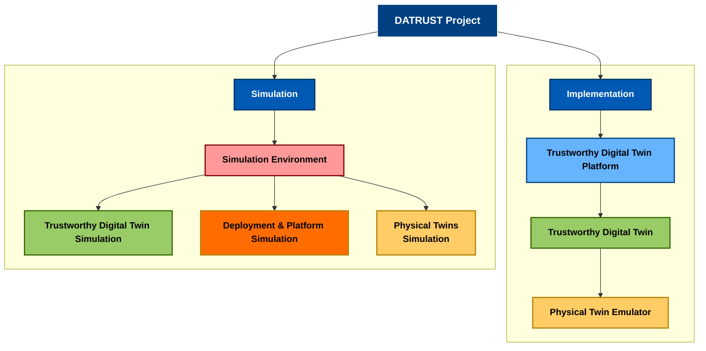

# PRIN PNRR 2022 - DATRUST - Connecting the physical and DigitAl worlds through TRUSTworthy data-flows

Today, data can be fruitfully used in several industrial fields. This capability is rooted in rapid and synergic ML/AI, and IoT advances. While ML/AI develops techniques for extracting actionable information from large bodies of data, IoT provides the foundations for collecting those large bodies of data. This process paves the way for such opportunities that Europe lists data as a critical asset to address societal challenges. However, these opportunities come with challenges.
Firstly, IoT is pushing a transition from static data sets stored in DBs to dynamic data flows. Indeed, data are continuously generated by heterogeneous data sources and reach applications in the form of data flows. 

Furthermore, the specific needs of ML/AI systems amplify this transition. For example, the inevitable decay of ML models trained over static data sets requires frequent re-training of systems already 
in production, which implies massive costs. Secondly, data flows come from various devices deployed in different environments and are consumed from applications and services with a comparable degree of heterogeneity, 
implying both network constraints (e.g., bandwidth, latency, faults) and computational constraints (e.g., low-powered devices unable to process high-bandwidth data). 
Because of this, data flows must be adaptively orchestrated, routed, transcoded, re-sampled, secured, and guaranteed in terms of SLAs to applications and services. 
We define this set of desirable properties of a data flow as data flow trustworthiness. We think that DTs can be used as the foundation for a distributed architecture
centered around guaranteeing the trustworthiness of data flows (whenever possible). DTs can not only mirror the properties and capabilities of physical objects, thus decoupling them from applications. 
They can also be used as active entities capable of autonomous decisions for augmenting the physical layer and, therefore, the data flows deriving from it. 
Despite these promising features, there is still the need for a unified platform for deploying, maintaining, and monitoring containerized DTs at scale.
Additionally, it is still unclear how DTs can manipulate, and guarantee data flows between physical objects and modern software services. 
This project aims at building a distributed platform rooted around the following objectives:

- Definition and the requirements of Data Flows Trustworthiness.
- Definition and modeling guidelines for new DTs supporting data-flow trustworthiness.
- Definition and implementation of a unified computing and networking infrastructure for supporting data collection/sharing between physical objects and software services, and relying on a middle-layer of DTs.
- Definition and implementation of the methodologies and algorithms for deploying, (re)configuring, maintaining and observing DTs and their interaction with physical objects and software services, to support trustworthy data flows.

## Project Modules Structure

## Project Repositories

- Physical Twin Emulator [Link](https://github.com/Datrust-Project/physical-twin-emulator)
- Trustworthy Digital Twin (TDT) [Link](https://github.com/Datrust-Project/trustworthy-digital-twin)
- Trustworty Digital Twin Platform [Link](https://github.com/Datrust-Project/trustworty-digital-twin-platform)
- Simulation [Link](https://github.com/Datrust-Project/Simu5G-DigitalTwins)
